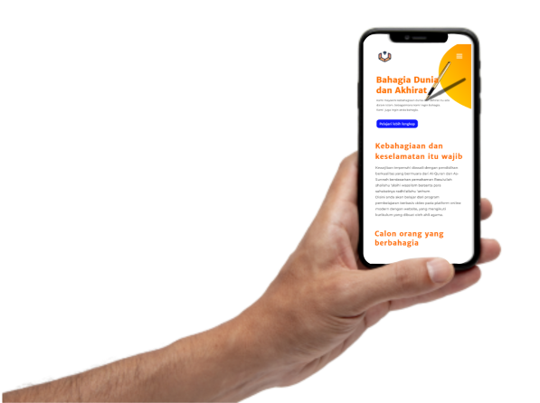

<!DOCTYPE html>
<html lang="id">
  <head>
    <meta charset="UTF-8" />
    <meta name="viewport" content="width=device-width, initial-scale=1.0" />
    <title>El Mahad : Sekolah Islam Online</title>
    <meta 
      name="description"
      content="El Mahad adalah sebuah kursus online berbasis website untuk belajar Agama Islam">
    
      
    <link rel="stylesheet" href="style.css" />
  </head>
  <body>
    <header>
      <nav class="grid">
        

          <a href="/index.html">
            <picture>
              <source 
                      type="image/webp" 
                      srcset="assets/desktop/logo-elmahad-nav-desktop.webp"
              >
              
            </picture>
          </a>
        

        

          
        

        <ul>
          <li><a href="#deskripsi">Kursus</a></li>
          <li><a href="#">Tanya kami</a></li>
          <li>
            <a class="sign-in" href="#">Sign in</a>
          </li>
          <li>
            <a class="daftar" href="#">Daftar</a>
          </li>
        </ul>
        

          <a href="#0" class="btn-close" onclick="closeSlideMenu()">&times;</a>
          <a href="#deskripsi">Kursus</a>
          <a href="#0">Tanya kami</a>
          <a href="#0" class="sign-in">Sign in</a>
          <a href="#0" class="daftar">Daftar</a>
        

      </nav>
      <section class="hero">
        

          <h1>Bahagia Dunia  dan Akhirat</h1>
          

            Kami meyakini kebahagiaan dunia dan akhirat itu ada di dalam Islam.
            Sebagaimana kami ingin bahagia. Kami juga ingin anda bahagia
          

          <a href="#deskripsi" class="cta">Pelajari lebih lengkap</a>
        

      </section>
    </header>

    <section id="deskripsi" class="pendahuluan">
      

        <h2>Kebahagian dan keselamatan itu wajib</h2>
        

          Kewajiban tersebut terpenuhi diawali dengan pendidikan berkualitas yang
          bermuara dari Al-Quran dan As-Sunnah berdasarkan pemahaman Rasulullah
          shallahu ‘alaihi wasallam berserta para sahabatnya radhi‘allahu ‘anhum
        

        

          Disini anda akan belajar dari program pembelajaran berbasis video pada
          platform online modern dengan website yang mengikuti kurikulum yang
          dibuat oleh ahli agama. Anda akan belajar :
        

      

      

        

          
          
Rukun Iman

        

        

          
          
Rukun Islam

        

        

          
          

            Mengenal Nama &amp; Sifat Allah ﷻ
          

        

        

          
          

            Mengenal Sifat &amp; Perilaku Rasulullah ﷺ
          

        

        

          
          
Adab Menuntut Ilmu Syari'i

        

        

          
          
Tafsir Surat Pendek

        

        

          
          
Muamalah Dasar

        

      

    </section>

    <section class="grupTargetUser">
      <h2>Dibuat agar orang berbahagia</h2>
      <!-- 

 -->
      
Program kami dibuat dengan tujuan untuk mencapai kebahagian dunia 
        dan akhirat. Dibuat untuk semua orang, terlebih bagi :

      

        

          
01

          <h3>Pelajar</h3>
          

            Identitas Islamik pada seorang muslim tidak boleh hilang.
            Pertahankan identitas anda di masa pergaulan bebas dan capai lah
            kebahagiaan hakiki
          

        

        

          
02

          <h3>Orang Tua</h3>
          

            Kebahagiaan keluarga tentunya merupakan idaman semua orang.
            Bimbing lah keluarga anda kepada kebahagiaan
          

        

        

          
03

          <h3>Pekerja</h3>
          

            Mencari nafkah untuk keperluan jasmani adalah hal yang terpuji.
            Terpenuhinya keperluan rohani adalah kebahagiaan sejati
          

        

      

    </section>

    <section class="grupFitur">
      <h2>Apa yang kamu dapatkan?</h2>
      

        

          
          

            <h3>Kurikulum berkualitas</h3>
            <ul class="fitur-list">
              <li>Pembelajaran terarah dan terbimbing</li>
              <li>Dibuat oleh para ahli agama</li>
              <li>Pembelajaran dirangkum</li>
              <li>Pembelajaran berjenjang</li>
            </ul>
          

        

        

          
          

            <h3>Platform modern</h3>
            <ul class="fitur-list">
              <li>Platform website</li>
              <li>Belajar dengan video</li>
              <li>Kuis</li>
              <li>Pembelajaran menarik</li>
              <li>Jadwal mandiri</li>
              <li>Akses materi selamanya</li>
              <li>Materi bisa di download</li>
            </ul>
          

        

        

          
          

            <h3>Pengajar terpercaya</h3>
            <ul class="fitur-list">
              <li>Lulusan Universitas Islam terpandang dan terpercaya</li>
              <li>Menggunakan Bahasa Indonesia</li>
            </ul>
          

        

        

          
          

            <h3>Kompetensi agama</h3>
            <ul class="fitur-list">
              <li>Pemenuhan pendidikan Islam yang wajib</li>
              <li>Sertifikat kelulusan</li>
            </ul>
          

          <a href="" class="cta">Daftar</a>
        

      

    </section>

    <section class="keunggulan">
      <picture>
        <source type="image/webp" srcset="assets/mobile/mengapa-kami.webp">
        
      </picture>
      

        <h2>Mengapa kami?</h2>
        

          Hanya kami satu-satunya di Indonesia yang menghadirkan program
          pendidikan Islam dengan platform website yang memiliki jadwal sesuai
          keinginan anda dan menjamin terpenuhinya pendidikan Islam yang wajib
        

      

    </section>

    <section class="rekomendasi">
      <h2>Rekomendasi Ustadz</h2>
      

        

          
          

            
<strong>Ust. Dr. Syafiq Riza Basalamah, Lc. MA.</strong>

            
Dosen tetap STDI Imam Syafi'i

            
Universitas Islam Madinah

            

          

          

            Lorem ipsum dolor sit amet, consetetur sadipscing elitr, sed diam
            nonumy eirmod tempo
          

        

        

          
          

            
<strong>Ust. Dr. Syafiq Riza Basalamah, Lc. MA.</strong>

            
Dosen tetap STDI Imam Syafi'i

            
Universitas Islam Madinah

            

          

          

            Lorem ipsum dolor sit amet, consetetur sadipscing elitr, sed diam
            nonumy eirmod tempo
          

        

        

          
          

            
<strong>Ust. Dr. Syafiq Riza Basalamah, Lc. MA.</strong>

            
Dosen tetap STDI Imam Syafi'i

            
Universitas Islam Madinah

            

          

          

            Lorem ipsum dolor sit amet, consetetur sadipscing elitr, sed diam
            nonumy eirmod tempo
          

        

      

    </section>

    

      <section class="biaya">
        <h2>Biaya program</h2>
        

          
0

          
Rp

        

        
* Tanpa syarat dan ketentuan

        <a href="" class="cta">Daftar</a>
      </section>
    

    
    <section class="partner">
      <h2>Partner kami</h2>
      

        <picture>
          <source 
                  type="image/webp" 
                  srcset="assets/desktop/hsi-desktop.webp 150w, assets/mobile/hsi-mobile.webp 200w"
                  sizes="(max-width: 1299px) 15vw, 150px">
          
        </picture>
        <picture>
          <source 
                  type="image/webp" 
                  srcset="assets/desktop/stdi-desktop.webp 150w, assets/mobile/stdi-mobile.webp 204w"
                  sizes="(max-width: 1299px) 15vw, 150px">
          
        </picture>
      

    </section>

    <section class="kerjasama">
      

        <h2>Dukung kami</h2>
        

          Tim kami fokus pada usaha untuk memberikan jalan untuk meraih
          kebahagian dunia dan akhirat kepada umat muslimin di era modern.
          Kami melakukan hal tersebut dengan memberikan pendidikan Islam
          sesuai Al-Quran dan As-Sunnah dengan platform website. Kami selalu
          senang mendapatkan partner yang memiliki visi yang sama dan ingin
          membantu kami menyebar kebahagiaan yang lebih merata pada umat
        

        <a href="" class="cta">Saya mau</a>
      

      <picture>
        <source type="image/webp" srcset="assets/mobile/dukung-kami@2x.webp">
        
      </picture>
    </section>
    

      <footer class="grid">
        

          <a href="index.html">
            <picture>
              <source type=image/webp srcset="assets/desktop/logo-elmahad-footer-desktop.webp">
              
            </picture>
          </a>
        

        

          

            
Alamat kantor

            
Jalan Ahmad Dahlan no. 69 RT 5 RW 3 Karanganyar Ambulu Jember
              68172

          

          

            
Hubungi kami

            
elmahadindonesia@gmail.com

          

        

        

          
Media Sosial

          <a href="" class="social">Instagram</a>
          <a href="" class="social">Facebook</a>
          <a href="" class="social">Youtube</a>
        

        
Copyright &copy;2020 Yayasan El-Mahad

      </footer class="grid">
    

    
  </body>
</html>
